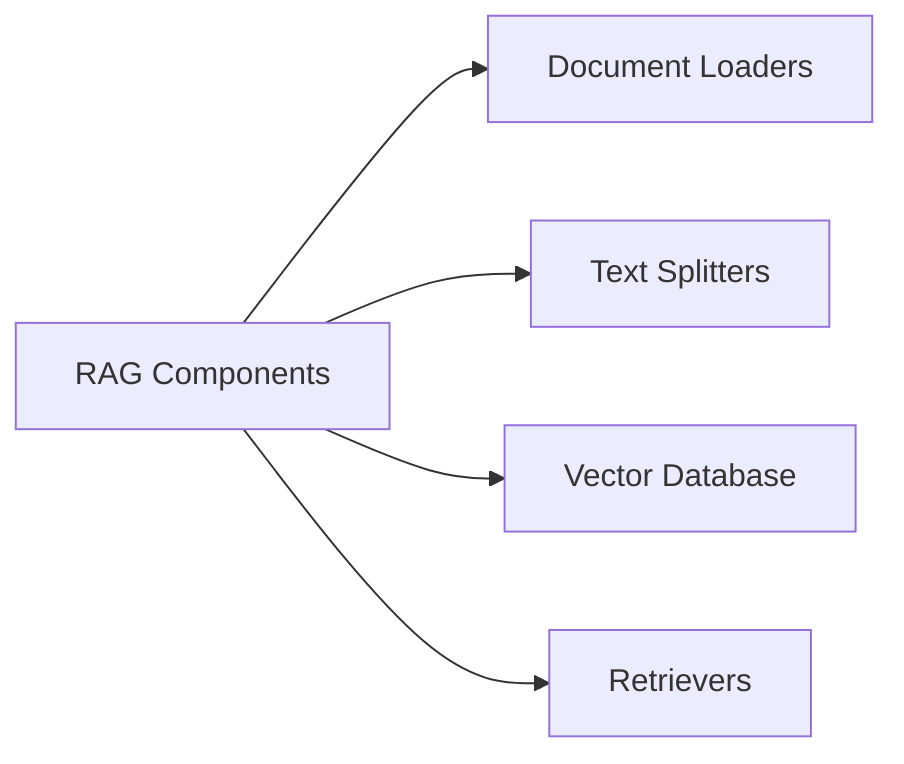

# Rag
RAG is a technique that **combines information retrieval with language generation**, where a model retrieves relevant documents from a **knowledge base** and then uses them as context to generate accurate and grounded responses.

#### Bnefits of using RAG:
1. Use of up-to-date information 
2. Better privacy
3. No limit of document size

## RAG Components

