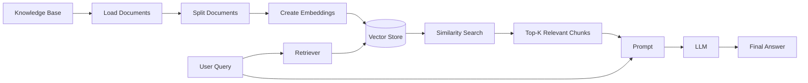
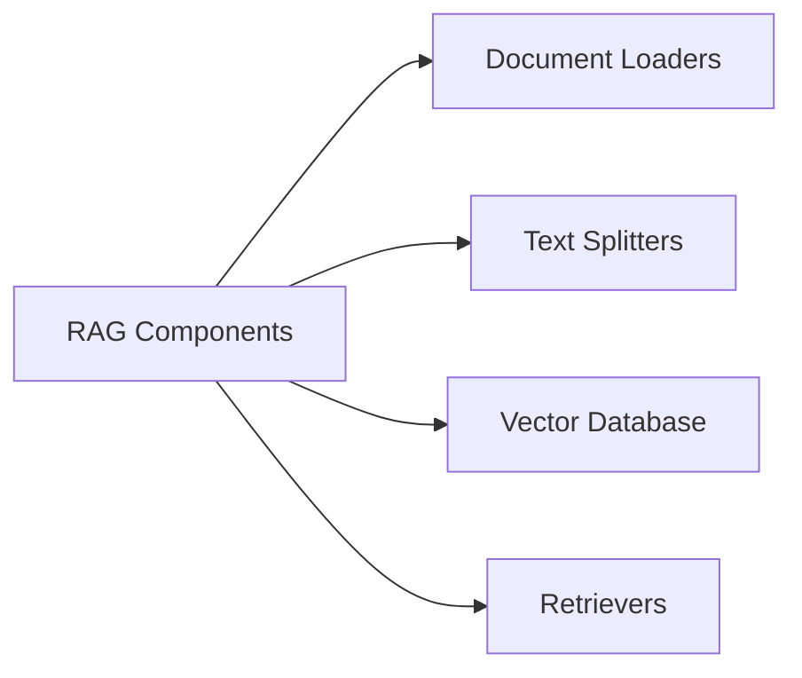

# Rag
RAG is a technique that **combines information retrieval with language generation**, where a model retrieves relevant documents from a **knowledge base** and then uses them as context to generate accurate and grounded responses.

#### Bnefits of using RAG:
1. Use of up-to-date information 
2. Better privacy
3. No limit of document size

**Indexing (Knowledge Base & Load Documents):**
In this step, we fetch the original documents or data from the actual source and load them using a document loader.

**Text Chunking:**
After loading the documents, we split them into smaller chunks. This makes it easier to process and retrieve relevant information.

**Embedding:**
We convert each text chunk into a vector (embedding) using an embedding model. These embeddings capture the semantic meaning of the text.

**Vector Store:**
Finally, we store all the embeddings in a vector database (vector store) so they can be efficiently searched and retrieved later.

## RAG Components

