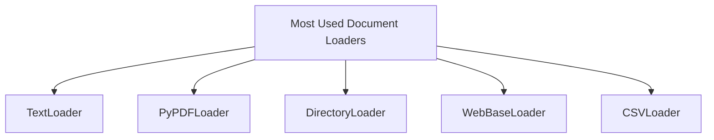

# [Document Loader](https://reference.langchain.com/python/langchain-community/document-loaders)

Document loaders are LangChain components that load data from different sources into a standardized format (usually `Document` objects). These `Document` objects are then used for chunking, embedding, retrieval, and generation.

```python
Document(
    page_content="The actual text content",
    metadata={"source": "filename.pdf", ...}
)
```
## Most Use Document Loaders
**TextLoader:** Loads plain text files. Ideal for chat logs, scraped text, transcripts, code snippets, or any other plain text data.

--- 

**PyPDFLoader:** Loads content from PDF files and converts each page into a `Document` object. It uses the PyPDF library under the hood. It is not suitable for scanned PDFs or PDFs with complex layouts.

---

**DirectoryLoader:** Loads documents from a directory.

---

**WebBaseLoader:** Loads content from web pages. It uses BeautifulSoup under the hood to parse HTML and extract visible text. Best for blogs, news articles, or other public websites with primarily text-based, static content.

---

**CSVLoader:** Loads data from CSV files, creating one `Document` object per row.

---

