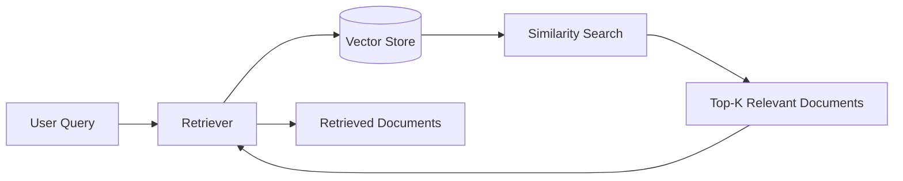

# [Retrievers](https://docs.langchain.com/oss/python/integrations/retrievers/index#all-retrievers)

A **Retriever** is a LangChain component that finds and returns the most relevant documents for a user's query. It does **not** generate answers—it only retrieves documents from a data source.

> All retrievers in LangChain implement the **Runnable** interface, so they can be used inside LangChain pipelines.

## Types of Retrievers

Retrievers can be categorized in two ways:

### 1. Based on the Data Source

These retrievers work with different types of data sources.

- Vector Store Retriever (FAISS, Chroma, PGVector, Pinecone, etc.)
- Wikipedia Retriever
- Arxiv Retriever
- Web Retriever
- BM25 Retriever

### 2. Based on the Retrieval Strategy

These retrievers change **how documents are searched or filtered**, regardless of where the data is stored.

- MMR Retriever
- Multi-Query Retriever
- Contextual Compression Retriever

---
## Data Source Based 

**Wikipedia Retriever:** A Wikipedia Retriever is a retriever that queries the Wikipedia API to fetch relevant content for a given query.

**How It Works**

1. You give it a query (e.g., "Albert Einstein")
2. It sends the query to Wikipedia's API
3. It retrieves the most relevant articles
4. It returns them as LangChain Document objects

---

**Vector Store Retriever:** A Vector Store Retriever in LangChain is the most common type of retriever that lets you search and fetch documents from a vector store based on semantic similarity using vector embeddings.

**How It Works** 
1. You store your documents in a vector store (like FAISS, Chroma, Weaviate)
2. Each document is converted into a dense vector using an embedding model
3. When the user enters a query:
    - It's also turned into a vector
    - The retriever compares the query vector with the stored vectors
    - It retrieves the top-k most similar ones

---

## Retrieval Strategies

### Maximal Marginal Relevance (MMR)

MMR retrieves documents that are:

- Relevant to the query
- Different from each other

Instead of returning several nearly identical documents, MMR increases diversity while keeping the results relevant.

**Goal:** Return relevant documents with less redundancy.

---

### Multi-Query Retriever

Sometimes one query isn't enough because the same idea can be written in many different ways.

**Example**

Query:

> "How can I stay healthy?"

Possible meanings:

- What should I eat?
- How often should I exercise?
- How can I reduce stress?

A normal similarity search may miss documents that use different wording.

**How it works**

1. Takes the original query.
2. Uses an LLM to generate multiple versions of the query.
3. Searches using each query.
4. Combines and removes duplicate results.

**Goal:** Improve recall by searching from multiple perspectives.

---

### Contextual Compression Retriever

Sometimes the retrieved documents contain a lot of unnecessary information.

The Contextual Compression Retriever removes irrelevant parts and keeps only the content related to the user's query.

**How it works**

1. A base retriever fetches documents.
2. A compressor (usually an LLM) processes each document.
3. Only the relevant sections are kept.
4. The compressed documents are returned.

**Goal:** Reduce irrelevant context before sending documents to the LLM.s relevant to the query.
4. Irrelevant content is discarded.