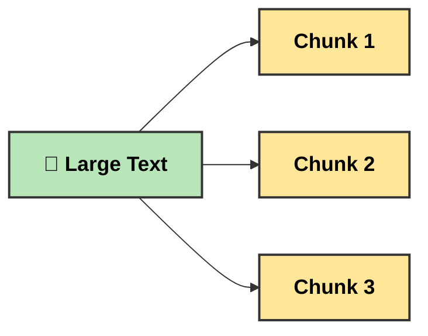
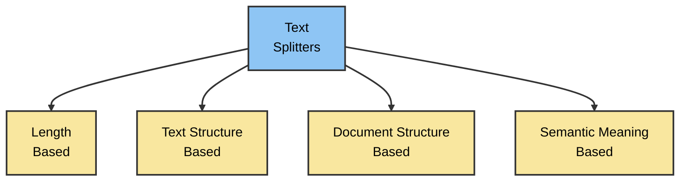

# [Text Splitting](https://chunkviz.up.railway.app/)

Text Splitting is the process of breaking **large chunks of text** (like articles, PDFs, HTML pages, or books) into smaller, manageable pieces (chunks) that an LLM can handle effectively.

# Why we Split Large Text into Chunks?

## 1. Overcoming Model Limitations

Many embedding models and language models have **maximum input size constraints**. Splitting large documents into smaller chunks allows us to process content that would otherwise exceed these limits.

---

## 2. Improving Downstream Tasks

Text splitting improves the performance of nearly every LLM-powered task.

| Task | Why Splitting Helps |
|------|----------------------|
| **Embedding** | Short chunks produce more accurate vector embeddings. |
| **Semantic Search** | Search results point to focused, relevant information instead of noisy, unrelated content. |
| **Summarization** | Smaller chunks reduce hallucinations and help maintain topic consistency. |

---

## 3. Optimizing Computational Resources

Working with smaller chunks of text can:

- Reduce memory usage
- Improve computational efficiency
- Enable better parallel processing
- Speed up document processing pipelines

# Types of text Splitters

 **Length-Based Text Splitting:** This technique divides a document into smaller chunks based on a fixed size, such as a specific number of characters, words, or tokens. It is one of the simplest text-splitting methods and is commonly used when the document's structure is not important.

**Structure-Based Text Splitting:** In this text splitting technique, we keep the natural structure of the text or document instead of splitting it only based on a fixed number of characters or tokens. The splitter follows the document's structure by first splitting at paragraphs, then sentences, then words, and if the chunk is still too large, it finally splits by characters.

**sementic meaning based:** In this technique, we use embeddings to split text based on its meaning instead of its length or structure. First, we create initial chunks using any splitting technique that fits our data. Then, we generate embeddings for those chunks and calculate the cosine similarity between consecutive chunks. If the cosine similarity suddenly drops, it usually means the topic has changed or the next chunk is no longer closely related to the previous one. We split the text at that point to keep each chunk focused on a single topic.