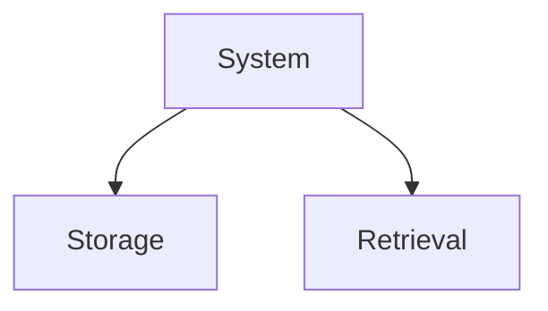
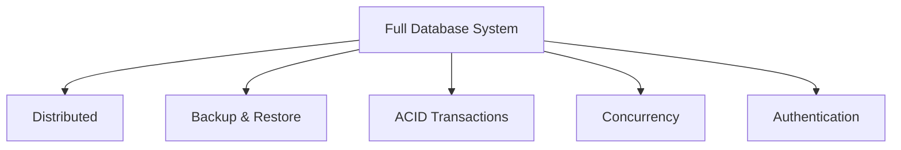

# [Vector Stores](https://docs.langchain.com/oss/python/integrations/vectorstores)

**Vector Store:** A vector store is a system designed to store, index, and retrieve vector embeddings (numerical representations of data). It consists of two main parts:
- **Storage** – stores the vector embeddings.
- **Retrieval** – efficiently finds the most similar vectors using similarity search.

Unlike traditional databases, a vector store is optimized for semantic search, allowing you to retrieve data based on meaning rather than exact keyword matches.

### Key Features
1. **Storage** - Ensures that vectors and their associated **metadata** are retained, whether in-memory(RAM) for quick lookups or on-disk(Hard-drive) for durability and large-scale use.

2. **Similarity Search** - Helps retrieve the vectors most similar to a query vector.

3. **Indexing** - Provide a data structure or method that enables **fast similarity searches** on high-dimensional vectors (e.g., approximate nearest neighbor lookups).

4. **CRUD Operations** - Manage the lifecycle of data-adding new vectors, reading them, updating existing entries, removing outdated vectors.

### Use-cases
1. Semantic Search
2. RAG
3. Recommender Systems
4. Image/Multimedia search

---

# Vector Store Vs Vector Database

A vector database is effectively a vector store with extra database features (e.g., scaling, security, metadata filtering, and durability)

## 1. Vector Store (The Lightweight Tool)

A simple library or service focused on doing two basic things: storing vectors (embeddings) and performing similarity searches.

**Best for:** Prototyping, testing, and small-scale applications.

**Limitations:** It generally lacks standard database features (like backups, strict security, or complex querying).

**Example:** FAISS

## 2. Vector Database (The Full System)

A complete, robust database system designed specifically to manage and query vectors at scale.

**Best for:** Real-world production environments and handling massive datasets.

**Key "Database" Features Included:**

**Scaling:** Distributed architecture to handle growth.

**Reliability:** Backups, restores, and ACID (data reliability) guarantees.

**Management:** Handles metadata (schemas/filters) and concurrency (multiple users at once).

**Security:** Authentication and authorization.

**Examples:** Milvus, Qdrant, Weaviate etc.

---
